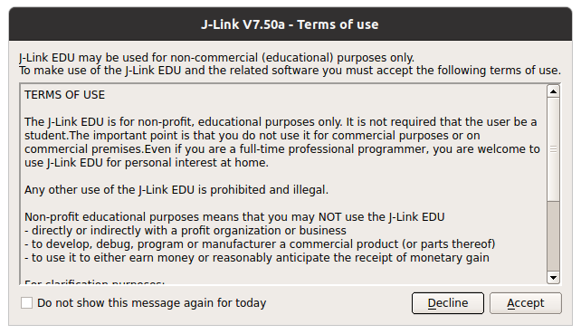

# JLinkAcceptClicker

Automatically clicks 'Accept' in the JLink license dialogue. For Linux with X Server.  
Requires **xdotool** from your favourite package manager. xdotool will generate a bit of system log spam. 
If you know how to get something similar working on Wayland, please let me know!

### Usage
Just run the script in a terminal. It searches for the right window and clicks the 'Accept' Button by pressing the keyboard shortcut Alt+a. I suggest you add the script to your autostart files for convenience

### Alternative
https://github.com/lucoot/jlinkEDUagree/blob/main/jlinkEDUagreeOSX.sh
Modify ~/.config/SEGGER/SEGGER_REG_HKEY_CURRENT_USER.xml
